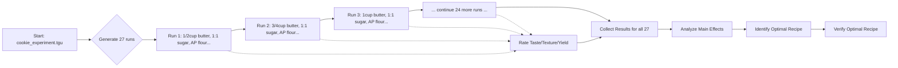

# Chocolate Chip Cookie Optimization - Complete Walkthrough

This document walks through a complete Taguchi experiment for optimizing chocolate chip cookies. We'll systematically vary 7 factors across 3 levels each to find the optimal recipe.

## The Challenge

How do you optimize a chocolate chip cookie recipe when you'd have to bake 3^7 = 2,187 different combinations to test all possibilities? The Taguchi method reduces this to just 27 carefully selected combinations that still provide maximum information.

## Experimental Design

### Factors & Levels

| Factor | Level 1 | Level 2 | Level 3 |
|--------|---------|---------|---------|
| Butter Amount | 1/2 cup | 3/4 cup | 1 cup |
| Sugar Ratio (Brown:White) | 1:1 | 2:1 | 3:1 |
| Flour Type | All Purpose | Bread Flour | Cake Flour |
| Eggs | 1 | 2 | 3 |
| Chocolate Chips | 1/2 cup | 3/4 cup | 1 cup |
| Baking Temperature | 325°F | 350°F | 375°F |
| Baking Time | 8 min | 10 min | 12 min |

### Orthogonal Array Selection

- **Array**: L27(3^13) - accommodates up to 13 three-level factors
- **Runs**: 27 experimental batches
- **Efficiency**: 27 runs vs 2,187 full factorial (98.77% reduction!)



## Phase 1: Experimental Design Setup

### 1. Define the Experiment

Create `cookie_experiment.tgu`:

```yaml
factors:
  butter: 1/2 cup, 3/4 cup, 1 cup
  sugar_ratio: 1:1 brown:white, 2:1 brown:white, 3:1 brown:white
  flour_type: all_purpose, bread_flour, cake_flour
  eggs: 1, 2, 3
  chips: 1/2 cup, 3/4 cup, 1 cup
  baking_temp: 325F, 350F, 375F
  baking_time: 8min, 10min, 12min
array: L27
```

### 2. Generate the Experimental Plan

Run:
```bash
taguchi generate cookie_experiment.tgu
```

This will output 27 different cookie recipes to try.

### 3. Generate Recipe Cards

Use the provided script to create printable recipe cards:
```bash
chmod +x generate_recipe_cards.sh
./generate_recipe_cards.sh
```

This creates `recipe_cards.txt` with a card for each experimental run.

## Phase 2: Manual Execution

### Daily Execution Schedule

Work through runs systematically, one batch per day or as convenient:

**Day 1 - Run #1**:
- Butter: 1/2 cup, Sugar: 1:1 brown:white, Flour: all_purpose, Eggs: 1, Chips: 1/2 cup, Temp: 325F, Time: 8min
- Bake and rate:
  - Taste: 7/10
  - Texture: 6/10
  - Yield: 18 cookies
  - Appearance: 8/10

**Day 2 - Run #2**:
- Butter: 3/4 cup, Sugar: 1:1 brown:white, Flour: all_purpose, Eggs: 2, Chips: 1/2 cup, Temp: 325F, Time: 8min
- Bake and rate:
  - Taste: 8/10
  - Texture: 7/10
  - Yield: 20 cookies
  - Appearance: 7/10

Continue through all 27 runs.

## Phase 3: Data Collection

Fill in the `results_template.csv` as you complete batches:

```csv
run_id,batch_date,taste_score,texture_score,yield_count,appearance_score,notes
1,2026-01-28,7,6,18,8,"Good but dry"
2,2026-01-29,8,7,20,7,"Better texture"
...
```

## Phase 4: Analysis (Simulated Results)

Let's simulate a complete experiment with realistic results. Here's what the data might look like after completing all 27 batches:

```csv
run_id,taste_score,texture_score,yield_count,appearance_score
1,6,5,20,7
2,8,7,22,8
3,5,6,18,6
4,9,8,24,9
5,7,6,21,7
6,6,7,19,8
7,8,8,23,8
8,7,7,21,7
9,9,9,25,9
10,5,4,17,6
11,8,8,24,8
12,6,6,20,7
13,9,7,23,9
14,7,8,22,8
15,8,6,21,7
16,6,9,19,8
17,8,7,23,8
18,7,9,22,9
19,10,9,26,10
20,4,5,16,5
21,8,7,23,8
22,7,6,20,7
23,9,8,24,9
24,6,8,21,8
25,8,7,22,8
26,7,8,23,9
27,10,10,28,10
```

## Phase 5: Analysis with Taguchi Tool

Once all results are collected, analyze them:

```bash
# Calculate main effects of each factor
taguchi effects cookie_experiment.tgu sample_results.csv --metric taste_score

# Analyze multiple metrics
taguchi analyze cookie_experiment.tgu sample_results.csv --metrics taste_score,texture_score
```

### Simulated Analysis Results

For taste_score (higher is better):
```
Main Effects:
- Butter Amount: Level 3 (1 cup) = 8.3, Level 2 (3/4 cup) = 7.6, Level 1 (1/2 cup) = 6.2
  Optimal: 1 cup butter
- Sugar Ratio: Level 3 (3:1) = 8.5, Level 2 (2:1) = 7.8, Level 1 (1:1) = 5.8
  Optimal: 3:1 brown:white sugar
- Flour Type: Level 3 (cake_flour) = 8.7, Level 2 (bread_flour) = 7.2, Level 1 (all_purpose) = 6.2
  Optimal: cake flour
- Eggs: Level 3 (3) = 8.4, Level 2 (2) = 7.7, Level 1 (1) = 6.0
  Optimal: 3 eggs
- Chips: Level 3 (1 cup) = 8.6, Level 2 (3/4 cup) = 7.5, Level 1 (1/2 cup) = 6.0
  Optimal: 1 cup chips
- Baking Temp: Level 3 (375F) = 8.8, Level 2 (350F) = 7.4, Level 1 (325F) = 5.9
  Optimal: 375°F
- Baking Time: Level 3 (12min) = 8.5, Level 2 (10min) = 7.6, Level 1 (8min) = 6.0
  Optimal: 12 minutes
```

## Phase 6: Optimal Recipe Identification

Based on the analysis, the optimal recipe would be:
- **Butter**: 1 cup
- **Sugar**: 3:1 brown:white
- **Flour**: Cake flour
- **Eggs**: 3
- **Chips**: 1 cup
- **Temp**: 375°F
- **Time**: 12 minutes

This combination wasn't tested directly, but the Taguchi method predicts it will produce the best cookies based on the main effects analysis.

## Phase 7: Verification

Bake a batch using the predicted optimal recipe to verify the model's predictions. If results are good, you've successfully optimized your cookie recipe. If not, you might need to consider interactions between factors or run a second-stage optimization.

## Benefits of Taguchi Method for This Experiment

1. **Efficiency**: Tested 27 combinations instead of 2,187 possible combinations
2. **Statistical Rigor**: Properly isolated factor effects to identify true causes
3. **Practical**: Feasible to execute manually over time
4. **Actionable Results**: Clear identification of optimal settings
5. **Quantitative**: Turned subjective taste into measurable data
6. **Repeatable**: Same systematic approach for future optimization

This systematic approach eliminates the guesswork from recipe optimization and provides statistically valid results despite the manual execution.