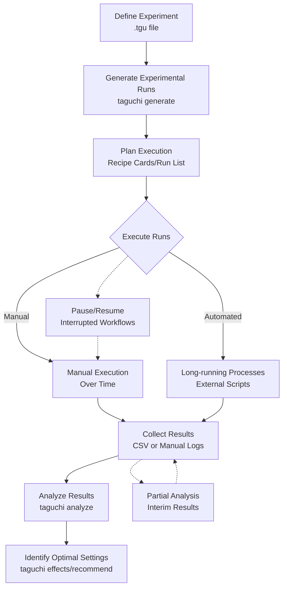

# Taguchi Array Tool - Long Running and Manual Experiments

## Overview

The Taguchi Array Tool can effectively manage experiments that take time to complete, whether they're automated processes that run for hours/days or manual experiments like cooking/baking that require human execution over time. This document explains the workflow for managing such experiments.

## Key Concepts for Delayed Experiments

### 1. **Separation of Planning and Execution**
- **Design Phase**: Use `taguchi generate` to plan all experiments upfront
- **Execution Phase**: Run each experiment manually or wait for long-running processes
- **Analysis Phase**: Use `taguchi analyze` on collected results when ready

### 2. **External Process Model**
The `taguchi run` command uses external scripts for each experimental run, making it ideal for:
- Long-running automated processes (hours/days)
- Manual experiments (manual execution over time)
- Interrupted workflows (pause and resume)
- Parallel execution across multiple physical devices

### 3. **State Management**
- Experimental design remains constant
- Results are collected separately
- Analysis happens when all data is available

## Typical Workflow for Long-Running Experiments



## For Automated Long-Running Processes

### Example: Stress Testing Server Performance

```bash
# Define experiment
factors:
  threads: 1, 4, 16
  timeout: 30s, 60s, 120s  
  workers: 2, 4, 8
array: L9

# Execute - each run might take hours
taguchi run stress_test.tgu './load_test.sh'

# Script sets environment variables:
# TAGUCHI_threads=4, TAGUCHI_timeout=60s, etc.
```

## For Manual Experiments

### Example: Chocolate Chip Cookie Optimization
1. **Generate 27 experimental combinations** using L27 array
2. **Bake one batch per day** with specified ingredient amounts 
3. **Rate each batch** on taste, texture, yield
4. **Analyze results** after all 27 batches complete
5. **Identify optimal cookie recipe**

## Data Collection Strategies

### For Manual Experiments:
- Pre-formatted result templates
- Rating scales (1-10) for subjective measures
- Photography for visual metrics
- Weight/volume measurements for quantitative metrics

### For Automated Processes: 
- Structured output files (CSV, JSON)
- Log file parsing
- Database result collection
- Real-time status tracking (optional)

## Best Practices

1. **Randomize Run Order**: Prevent day-to-day variations from biasing results
2. **Track Execution Time**: Monitor for temporal effects
3. **Handle Missing Runs**: Plan for when experiments fail
4. **Batch Processing**: Group runs logically (same day, same equipment)
5. **Quality Control**: Include repeat runs of standard recipe occasionally

## Advantages for Long-Running Experiments

- **Minimized Total Time**: Orthogonal arrays provide maximum information with minimum runs
- **Flexible Scheduling**: Execute runs as convenient over time
- **Robust Statistics**: Properly isolate factor effects despite time gaps
- **Progress Tracking**: Monitor optimization progress with partial results
- **Error Recovery**: Resume experimentation after interruptions

## Integration with Your Workflow

The Taguchi Array Tool complements your existing processes rather than replacing them:
- **Planning**: Generate optimal experiment sequences
- **Tracking**: Manage complex multi-factor trials
- **Analysis**: Extract maximum insight from limited tests
- **Optimization**: Identify best parameter combinations

This makes it ideal for R&D labs, manufacturing optimization, product development, and any scenario where experiments are time-intensive but systematic optimization is needed.